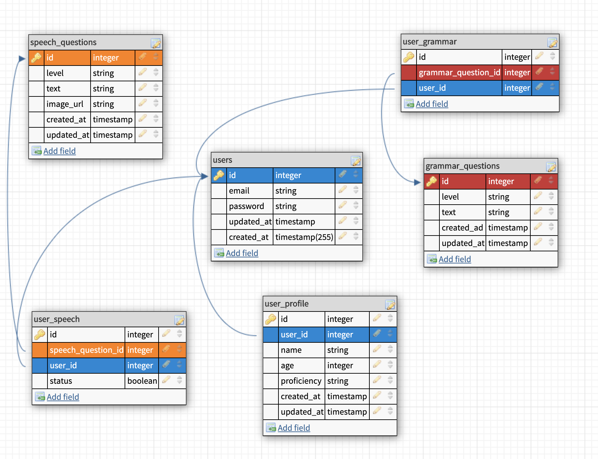

# ai_language_tutor
A personalized curriculum made for you 

## Technologies:
This API was written entirely in python using the following libraries:
- Flask
- SQLAlchemy
  - With a postgres database
- Bcrypt (python)
- Travis CI
- Heroku deployment and hosting

### Use of this API
This api is used to create and login users. Then it is able to return questions based on the specified proficiency level, and whether or not the user has answered them already.


 <details>
  <summary> <code>POST</code> and <b>Create</b>
  a new user </summary>

  example request : `POST` `/`
  <br>
  example successful response: 

  ```json
{
  "email": "greg@test.com",
  "id": 7
}
  ```

  example <b>un</b>successful response: 

  ```json
{
    "error": "Email already exists"
}
```
### Required Keys in body of request:
| Key        | Datatype           |
| :-------------: |:-------------:|
| email      | `<string>` |
| password      | `<string>`      |

### Statuses:
 | Status        | Meaning           |
| :-------------: |:-------------:|
| `201`      | Success |
| `409`      | Email already exists    |

</details>

---

 <details>
  <summary> <code>POST</code> and <b>Log in</b> an already existing user </summary>

  example request : `POST` `/login`
  <br>
  example successful response: 

  ```json
{
    "user_id": 1,
    "email": "greg@test.com",
    "name": "Greg",
    "age": 21,
    "proficiency": "Beginner"
}
  ```

  example <b>un</b>successful response: 

  ```json
{
    "error": "Email or password incorrect."
}
```
### Required Keys in body of request:
| Key        | Datatype           |
| :-------------: |:-------------:|
| email      | `<string>` |
| password      | `<string>`      |
### Statuses:
 | Status        | Meaning           |
| :-------------: |:-------------:|
| `200`      | Success |
| `401`      | Submitted email and/or password is incorrect     |

</details>

---

 <details>
  <summary> <code>POST</code> and <b>create a profile</b> for an already existing user </summary>

  example request : `POST` `/create_user_profile`
  <br>
  example successful response: 

  ```json
{
    "user_id": 1,
    "email": "greg@test.com",
    "name": "Greg",
    "age": 21,
    "proficiency": "Beginner"
}
  ```

  example <b>un</b>successful response: 

### Required Keys in body of request:
| Key        | Datatype           |
| :-------------: |:-------------:|
| user_id      | `<integer>` |
| email      | `<string>`      |
| name      | `<string>`      |
| age      | `<integer>`      |
| proficiency      | `<string>` (Beginner/Intermediate/Advanced)     |
### Statuses:
 | Status        | Meaning           |
| :-------------: |:-------------:|
| `200`      | Success |


</details>

---


### Schema 
<details>
<summary>Data flow and database schema (PSQL)</summary>


</details>


## Back End Collaborators
- [Nancy Lee](https://github.com/nancylee713)
- [Scott Schipke](https://github.com/sschipke)

